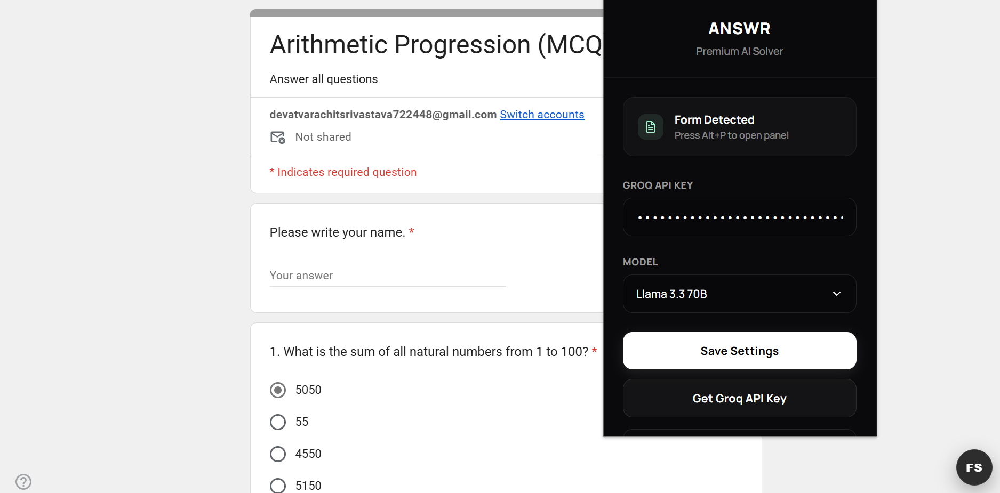
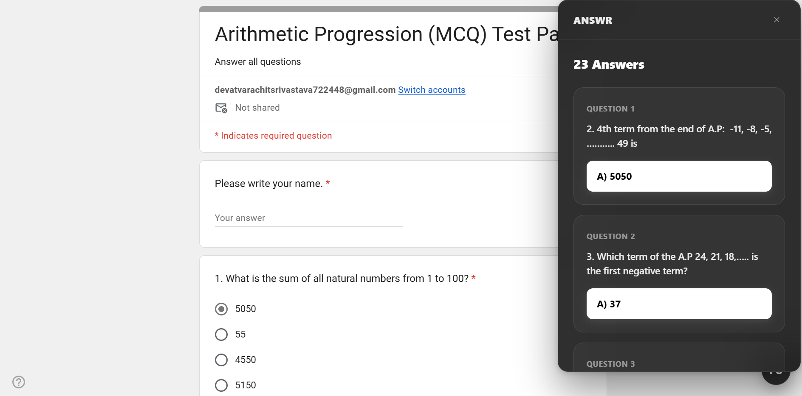

<div align="center">

# ANSWR

**Solve any Google Form in seconds — powered by Groq AI.**

[](https://developer.chrome.com/docs/extensions/mv3/intro/)
[](LICENSE)
[](https://groq.com)

</div>

---

## Overview

ANSWR is a lightweight Chrome extension that injects a floating panel into any Google Form, scrapes the questions, and returns AI-generated answers — instantly, without ever leaving the page.

No trackers. No servers. Just you, your API key, and blazing-fast Groq inference.

---

## Screenshots

<div align="center">

| Extension Popup | Solver Panel |
|:-:|:-:|
|  |  |

</div>

---

## Features

- **Instant answers** — scrapes MCQ and multi-select questions and solves them in one click
- **Fast inference** — powered by Groq's ultra-low-latency LLM API
- **Sleek UI** — dark glassmorphism panel that overlays cleanly on any form
- **Fully local** — your API key is stored on-device and only ever sent to Groq
- **Zero dependencies** — pure vanilla JS, no build step required

---

## Installation

> Requires Google Chrome with Developer Mode enabled.

1. **Clone or download** this repository
2. Go to `chrome://extensions/` in Chrome
3. Toggle on **Developer mode** (top-right corner)
4. Click **Load unpacked** and select the `formsolver-fixed/` folder
5. Click the ANSWR icon in your toolbar and paste your [Groq API key](https://console.groq.com/keys)

---

## Usage

Navigate to any Google Form, then:

| Shortcut | Action |
|----------|--------|
| `Alt + P` | Open / close the solver panel |
| `Alt + S` | Solve the form instantly |

You can also use the floating **FS** trigger button that appears at the bottom-right of every Google Form page.

### Quick Start

```
1. Open a Google Form
2. Press Alt + P  →  panel opens
3. Press Alt + S  →  answers appear
```

---

## Supported Models

| Model | Speed | Quality | Best For |
|-------|-------|---------|----------|
| Llama 3.3 70B | ⚡⚡ | ★★★ | Accuracy-critical forms |
| Llama 3.1 8B | ⚡⚡⚡ | ★★☆ | Fast, everyday use |
| Mixtral 8x7B | ⚡⚡ | ★★☆ | Balanced performance |

Switch models anytime from the popup or the panel's settings menu.

---

## Project Structure

```
formsolver-fixed/
├── manifest.json       # Extension manifest (MV3)
├── content.js          # Core logic — scraping, API calls, panel UI
├── content.css         # Panel and trigger button styling
├── popup.html          # Extension popup — settings & status
├── popup.js            # Popup logic — save config, detect forms
├── icons/              # Extension icons (16px, 48px, 128px)
└── screenshots/
    ├── popup.png
    └── panel.png
```

---

## Tech Stack

| Layer | Technology |
|-------|-----------|
| Platform | Chrome Extension (Manifest V3) |
| AI Backend | [Groq API](https://groq.com) |
| Language | Vanilla JavaScript (zero dependencies) |
| Styling | Custom CSS — glassmorphism design |
| Font | [Manrope](https://fonts.google.com/specimen/Manrope) via Google Fonts |

---

## Privacy

ANSWR is designed with privacy as a default, not an afterthought.

- Your Groq API key is saved to `chrome.storage.local` and **never** sent anywhere except directly to the Groq API
- No analytics, no telemetry, no third-party requests
- The extension only activates on `docs.google.com/forms/*` — it has no access to any other pages

---

## Contributing

Pull requests are welcome. For major changes, please open an issue first to discuss what you'd like to change.

---

## License

[MIT](LICENSE) — free to use, modify, and distribute.

---

<div align="center">
<sub>Built with a focus on aesthetics and simplicity.</sub>
</div>
